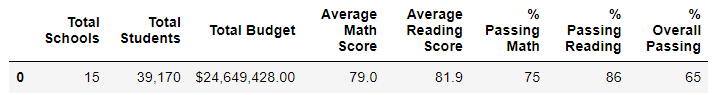

# School_District_Analysis

## Overview: 
This analysis will assist a school board in making decisions about the budget of a school district. It was previously completed, but needed changes because the 9th grade scores from Thomas High School were dishonest. For this analysis, those scores were changed to NaN (this is used to represent missing values in a dataset) and not taken into consideration. Here, we will look at standardized test scores in math and reading, the previous budget allotment, school sizes, and school types.

## Results: 
- How is the district summary affected?
Once the Thomas High School 9th graders were factored out 

- How is the school summary affected?

- How does replacing the ninth graders’ math and reading scores affect Thomas High School’s performance relative to the other schools?

- How does replacing the ninth-grade scores affect the following:
  - Math and reading scores by grade
  - Scores by school spending
  - Scores by school size
  - Scores by school type

## Summary: 
After the reading and math scores for the ninth grade at Thomas High School were replaced with NaNs, four changes occured in the updated school district analysis:
1. 
2. 
3. 
4. 