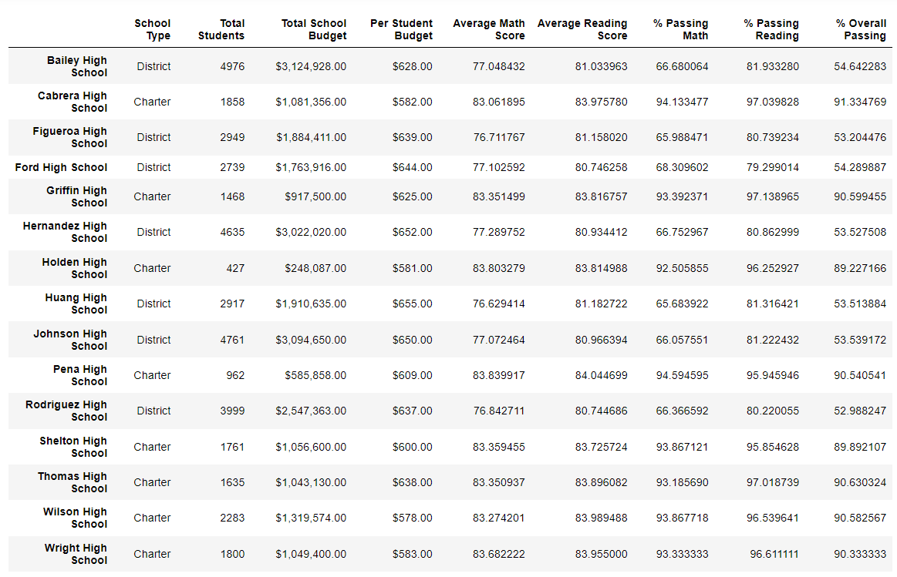
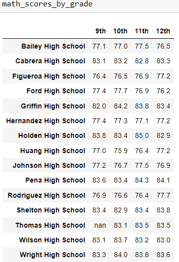
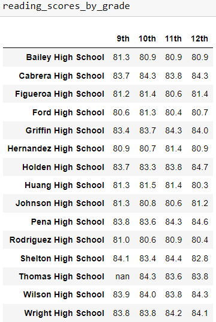
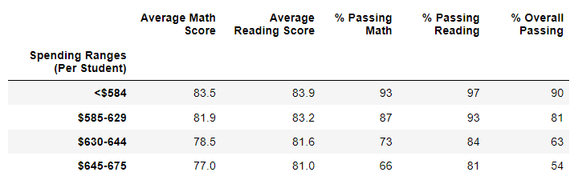
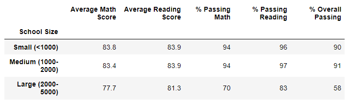
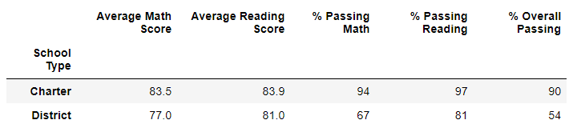

# School_District_Analysis

## Overview: 
This analysis will assist a school board in making decisions about the budget of a school district. It was previously completed, but needed changes because the 9th grade scores from Thomas High School were dishonest. For this analysis, those scores were changed to NaN (this is used to represent missing values in a dataset) and not taken into consideration. Here, we will look at standardized test scores in math and reading, the previous budget allotment, school sizes, and school types.

## Results: 
- How is the district summary affected?

  When the Thomas High School 9th graders were factored out, the % Passing Math, % Passing Reading, and % Overall Passing columns for the district summary dataFrame all changed. The percentage of students passing math went from 75% to 74.8%. The percentage of students passing reading went from 86% to 85.7%. Lastly, the percentage of overall students passing went from 65% to 64.9%. To summarize, there was slight decrease in the passing rates of students in the district. 

- How is the school summary affected?

  

  The new school summary dataframe is shown above. The school summary has rows according to each school and columns that hold information about each school. This means that the school summary was only affected in the Thomas High School row in the last 5 columns. These columns show the average scores for math and reading, percentage of students passing math and reading, and the percentage of overall students passing. Because of the academic dishonesty, these 5 columns were all expected to have decreased numbers but only 4 of them did. The Average Reading Score column increased by about .05. Because the % Passing Reading decreased from 97.31% to 97.02% we know that less students are passing now that the fake test scores have been removed, but why would the average reading scores increase? My theory is that the fake test scores were marked as above passing, but instead of giving the students a very high grade, a mediocre grade may have been used to make the numbers believable causing the actual reading average to be higher than the fake average.

- How does replacing the ninth graders’ math and reading scores affect Thomas High School’s performance relative to the other schools?

  Thomas High School was still ranked 2nd place after the forged math and reading scores were omitted. However, the distance between Thomas and the school ranked 3rd went from .35 to .03. So, it came very close to coming in 3rd place.

- How does replacing the ninth-grade scores affect the following:
  - **Math and reading scores by grade:** 
  
  Below are the 2 new dataframes for the math and reading scores by grade. For Thomas High School the 9th grade results were changed to NaN and all of the other scores were unaffected.
  
   
  
  - **Scores by school spending:** 
  
  
  
  Thomas High School falls into the $630 - $644 range of the dataframe above. This new table looks exactly like the old one, meaning the forged scores were not significant enough to alter the numbers when grouped other schools in the same spending range.
  
  
  - **Scores by school size:** 
  
  
  
  Thomas High School falls into the medium range of the dataframe above. This new table looks exactly like the old one, meaning the forged scores were not significant enough to alter the numbers when grouped other schools in the same size range.
  
  - **Scores by school type:** 
  
  
  
  Thomas High Schools falls into the charter school type. Like the 2 tables before this one, this new table looks exactly like the old one, meaning the forged scores were not significant enough to alter the numbers when grouped other charter schools.
  
## Summary: 
After the reading and math scores for the ninth grade at Thomas High School were replaced with NaNs, four changes occured in the updated school district analysis:

1. 
2. 
3. 
4. 